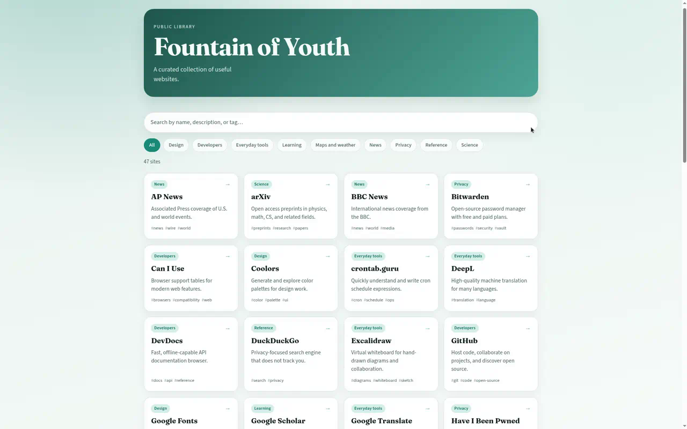

# Fountain of Youth

A public library of useful websites — curated, searchable, and easy to extend.

**[Open the library →](https://cryptosuess.github.io/FoutainOfYouth/)**

[](https://cryptosuess.github.io/FoutainOfYouth/)

Search by name, description, or tag. Filter by category. Hover a card (desktop) to preview the site, then click to open it.

## Run locally

```bash
# any static server from the repo root, e.g.
python3 -m http.server 8080
# then open http://localhost:8080
```

## Site schema

Entries live in [`data/sites.json`](data/sites.json). Each object:

| Field | Type | Notes |
| --- | --- | --- |
| `id` | string | Stable kebab-case id |
| `name` | string | Display name |
| `url` | string | Full https URL |
| `description` | string | One short sentence |
| `category` | string | One of the existing categories (or a new one) |
| `tags` | string[] | A few lowercase keywords |

Example:

```json
{
  "id": "wikipedia",
  "name": "Wikipedia",
  "url": "https://www.wikipedia.org/",
  "description": "Free encyclopedia anyone can edit.",
  "category": "Reference",
  "tags": ["encyclopedia", "research"]
}
```

## Add a site

1. Open an issue with the **Suggest a site** template, or fork and edit `data/sites.json`.
2. Keep descriptions factual and short; no affiliate links.
3. Open a pull request. Nothing is published until a maintainer merges it.

## Categories

Reference · Learning · Everyday tools · Developers · Design · Privacy · Maps and weather · News · Science · Crypto
